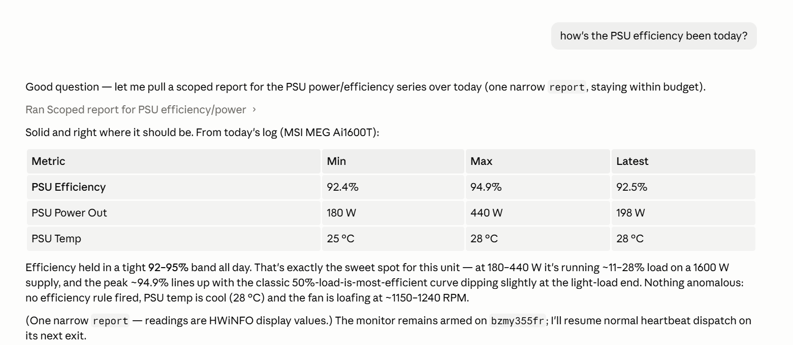
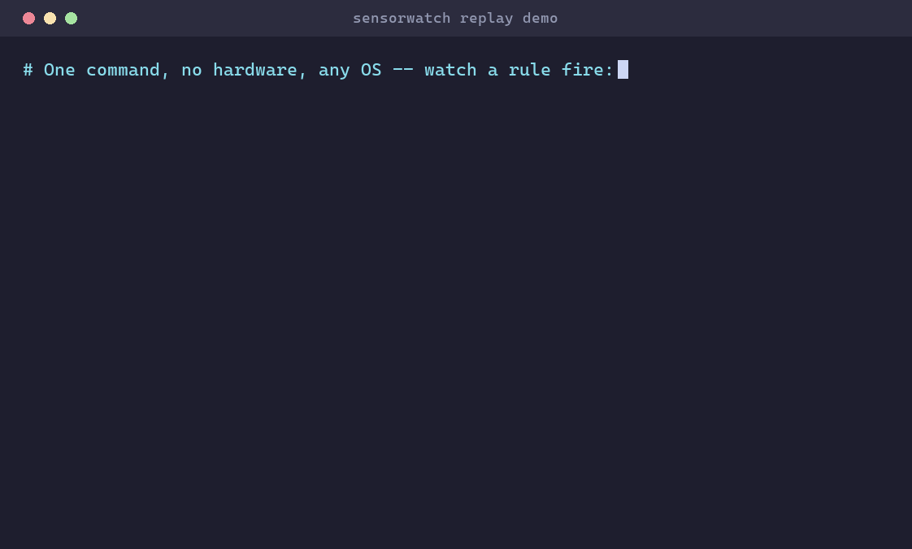
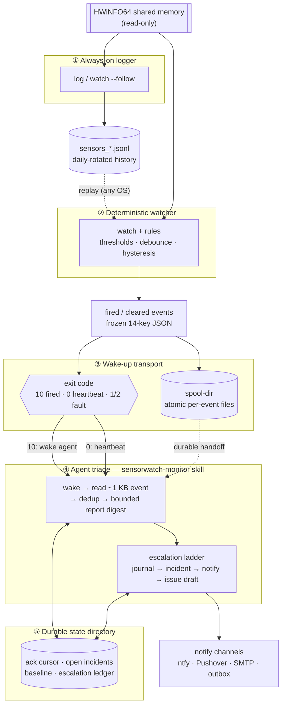

# sensorwatch

[](https://github.com/lcjanke2020/sensorwatch/actions/workflows/ci.yml)
[](https://pypi.org/project/sensorwatch/)
[](https://pypi.org/project/sensorwatch/)
[](https://crates.io/crates/sensorwatch)
[](LICENSE)

A lightweight hardware sensor monitor for Windows. It reads [HWiNFO64](https://www.hwinfo.com/)'s
shared-memory sensor feed and logs readings as JSON Lines with daily file
rotation — a small, dependency-light background process you can leave running
and analyze later.

PSU efficiency monitoring is the first use case (see the
[worked example](examples/psu-efficiency/) below), but sensorwatch is
sensor-agnostic: it captures anything HWiNFO exposes — temperatures, voltages,
currents, power, fan speeds, clocks, and usage.

[](docs/images/agent-monitor-psu-query.png)

*Ask in plain English how your hardware is doing. The [agent monitor skill](#skills)
turns a scoped `sensorwatch report` into a natural-language answer — here, a full
day of PSU efficiency summarized on request, with no log-parsing on your part.*

> **Flagship result:** a ~5.5-hour real-world capture shows the MSI MEG Ai1600T
> exceeds 80 PLUS Titanium efficiency at every measured load point (peak 94.5%,
> zero samples below 92%). Data, charts, and analysis:
> [`examples/psu-efficiency/`](examples/psu-efficiency/).

## Try it in 60 seconds — no hardware

sensorwatch reads real hardware on Windows, but its alerting engine is
platform-independent: `watch --replay` runs the exact same rule evaluation over
a *recorded* log, so you can see a critical alert fire — and clear — on Linux,
macOS, or Windows with no hardware at all.



```sh
cargo build --release --manifest-path rust/Cargo.toml -p sensorwatch-cli
cd examples/demo
../../rust/target/release/sensorwatch watch --config demo.toml --replay sensors_demo.jsonl
# → one JSON "fired" event on stdout, exit code 10 ("a rule fired")
```

On Windows PowerShell, invoke the built binary with backslashes:
`..\..\rust\target\release\sensorwatch.exe watch --config demo.toml --replay sensors_demo.jsonl`.

Walkthrough, the fixture, and the rule (with its debounce and hysteresis
guards): [`examples/demo/`](examples/demo/).

## Features

- **Reads HWiNFO64 shared memory** (`Global\HWiNFO_SENS_SM2`) directly via
  `ctypes` — no polling of HWiNFO's UI, no admin rights.
- **Sensor filtering** by case-insensitive substring include/exclude patterns.
- **JSON Lines output** with daily file rotation and configurable retention.
- **Graceful shutdown** on Ctrl+C / signals.
- **Light footprint** — a handful of stdlib modules plus `pendulum` (and `cffi`,
  which backs the native binding).
- **Optional native binding** (`sensorwatch.native`) — a cffi wrapper over the
  bundled C core that reads the same data through the native parser (see
  [Native binding](#native-binding-cffi)).
- **Rust CLI** (`rust/sensorwatch-cli`, binary `sensorwatch`) — the **canonical
  CLI**: a one-shot `snapshot` subcommand printing live readings as
  JSON with type and substring filters, a `log` subcommand (alias `run`) that
  replaces the Python logger loop with a single static binary (byte-compatible
  output included), a `watch` subcommand that evaluates declarative `[[rules]]`
  and emits structured JSON events for deterministic alerting, a `report`
  subcommand that condenses logged history into a bounded JSON digest — window
  aggregates, re-derived violations, and sampling gaps under a hard size cap —
  for humans and LLMs alike, and an `export` subcommand that materializes a
  time window as a flat Apache Parquet file, the deep-analysis surface for
  per-sample SQL with DuckDB/Polars/pandas on the consumer side (see
  [Rust binding](#rust-binding)).
- **Agent monitor skill** (`skills/sensorwatch-monitor/`) — teaches an agent to
  *be* the always-on monitor: arm `watch` as a wake-up primitive, triage its
  events on a fixed context budget, and keep durable ack / incident / escalation
  state on disk. Kept separate from the usage skill so the protocol is not loaded
  for a one-off reading (see [Skills](#skills)).

## Requirements

Requirements depend on what you're doing:

**To try the replay demo (any OS) — no hardware:**

- [Rust](https://rustup.rs/) 1.85+ (the CI MSRV) and a C compiler for the
  vendored native core — `cc`/`clang` on Linux/macOS, the MSVC Build Tools on
  Windows.
- To *query* a `sensorwatch export` Parquet file: any Parquet reader —
  [DuckDB](https://duckdb.org/), Polars, pandas — on the consumer side.
  sensorwatch itself gains no runtime dependency from this.

**To install and run the Python package / logger:**

- Windows (x64) and Python 3.12+. Prebuilt wheels mean no compiler is needed.

**To monitor live hardware (Windows):**

- [HWiNFO64](https://www.hwinfo.com/) running with **Shared Memory Support**
  enabled (Settings → Shared Memory Support) and the sensors window open. On the
  free (non-Pro) license, HWiNFO disables Shared Memory Support automatically
  after 12 hours — for genuinely always-on monitoring, use HWiNFO Pro (or
  periodically re-enable the feed).
- For the **agent monitor** specifically: Python 3.12+ as well — the
  [`sensorwatch-monitor`](skills/sensorwatch-monitor/SKILL.md) skill's state and
  triage helpers are stdlib-only Python scripts.

## Install

From PyPI — Windows wheels are prebuilt, so no compiler is needed:

```sh
pip install sensorwatch
```

> Note: as of 0.3.0 the package installs **no** `sensorwatch` command — that
> name belongs to the Rust CLI; the Python logger is invoked as
> `python -m sensorwatch`. Installs of 0.2.0 or earlier still ship a
> `sensorwatch` console script (the Python logger — no `snapshot` / `watch` /
> `report` subcommands); if a stale one shadows the Rust binary, upgrade the
> package or invoke the Rust binary by path (e.g.
> `rust/target/release/sensorwatch[.exe]`).

From source — this builds the native cffi extension, so a C compiler is required
(MSVC on Windows; gcc/clang elsewhere):

```sh
git clone https://github.com/lcjanke2020/sensorwatch
cd sensorwatch
pip install -e .          # or: uv sync
```

## Usage

The logger loop is available in two equivalent forms. The Rust CLI (repo-built;
see [Rust binding](#rust-binding)) is the canonical interface:

```sh
cd rust && cargo build --release -p sensorwatch-cli

# Sample on an interval and append JSONL records to daily files
./target/release/sensorwatch log                             # ./config.toml if present, else defaults
./target/release/sensorwatch log --config my.toml --verbose  # or: sensorwatch run (alias)
```

On Windows PowerShell, invoke the built binary with backslashes —
`.\target\release\sensorwatch.exe log --config my.toml --verbose` — and make
the same substitution in every `./target/release/sensorwatch` command below
(these live-read commands only return data on Windows, where HWiNFO runs).

The frozen Python logger does the same job without a Rust toolchain — module
form only:

```sh
# Run with the bundled default config
python -m sensorwatch

# Or point it at a config explicitly
python -m sensorwatch --config config.toml --verbose
```

If you previously ran the bare `sensorwatch` command from a 0.2.0-or-earlier
install, that job now belongs to the Rust CLI's `log` subcommand — invoked by
path as above, or as a bare `sensorwatch log` once you put the built binary on
`PATH` yourself; the `python -m sensorwatch` module form is unchanged.

The Python package stays in-tree as a **frozen reference implementation**: it
gathered the original PSU dataset, and its pure-Python shared-memory reader
([`sensorwatch/hwinfo_shm.py`](sensorwatch/hwinfo_shm.py)) documents the HWiNFO
wire format end to end. New CLI capability lands only in the Rust CLI.

If HWiNFO64 is not running (or shared memory is disabled), either logger warns
once and keeps trying — start HWiNFO and readings begin flowing.

For a one-shot reading instead of a logger loop, the Rust CLI prints a live
snapshot as JSON:

```sh
# still in rust/ from the build step above
./target/release/sensorwatch snapshot --type TEMPERATURE
```

For deterministic alerting, `watch` evaluates the config's [alert
rules](#alert-rules-rules) and turns the first firing rule into a structured
JSON event — the agent wake-up primitive:

```sh
# Block until a rule fires (exit 10) or the heartbeat elapses (exit 0)
./target/release/sensorwatch watch --timeout 3600

# Or follow indefinitely, logging sensors and appending events to daily files
./target/release/sensorwatch watch --follow
```

The **exit code is the signal**: `10` = a rule fired (its JSON event is on
stdout), `0` = clean timeout ("all quiet — re-arm"), `2` = a config/usage
error. A shell script dispatching on that code is a complete alerting system,
with no agent involved. The full contract — event schema, exit codes, the
five-layer monitoring architecture — is in
[docs/agent-monitoring.md](docs/agent-monitoring.md).

To review what already happened, `report` condenses logged history into one
bounded JSON digest — the sanctioned way for an agent to read the past without
parsing raw logs:

```sh
# What happened in the last 24 h: aggregates, violations, gaps, liveness — one call
./target/release/sensorwatch report

# A focused, pretty-printed window under an explicit byte budget
./target/release/sensorwatch report --last 6h --match psu --indent 2 --max-bytes 4096
```

Every reading row is aggregated over the window itself (HWiNFO's source-lifetime
`min`/`max`/`avg` are ignored as wrong for a window); violations are re-derived
by the same deterministic engine as `watch`; `meta.samples`/`last_sample` make a
zero-sample digest the "logger is dead" signal in a single call; and
`--max-bytes` guarantees the output fits an agent's context budget. Full flag
tour and the digest schema:
[rust/sensorwatch-cli/README.md](rust/sensorwatch-cli/README.md#report).

When aggregates aren't enough, `export` materializes a window as a flat Apache
Parquet file — one row per reading per sample — for **deep analysis** with any
SQL engine:

```sh
# Materialize the last 24 h, then ask a per-sample question with DuckDB
./target/release/sensorwatch export --last 24h --out sensors.parquet
duckdb -c "SELECT reading, max(value) FROM read_parquet('sensors.parquet')
           WHERE type = 'Temperature' GROUP BY reading LIMIT 10"
```

Six fixed columns (`timestamp` in UTC microseconds, `sensor`, `reading`,
`type`, `unit`, nullable `value`), streamed through the same bounded parser as
`report`. The digest remains the first-line surface — reach for `export` only
when a question genuinely needs individual samples. Schema and flags:
[rust/sensorwatch-cli/README.md](rust/sensorwatch-cli/README.md#export).

## Running from WSL-2

sensorwatch is a Windows program, but you can launch it from a WSL-2 shell via
Windows interop — convenient if you prefer WSL-2's persistent SSH / terminal
multiplexer (tmux, WezTerm) sessions. You can't run it as a native Linux
process; you drive the Windows build from the WSL-2 side. See
[docs/running-from-wsl2.md](docs/running-from-wsl2.md).

## Output format

One JSON object per sample, written to `logs/sensors_YYYY-MM-DD.jsonl`:

```json
{"timestamp": "2026-02-18T08:17:48-05:00", "sensors": [
  {"sensor": "MEG Ai1600T", "reading": "+12V", "type": "Voltage", "value": 12.03, "min": 12.01, "max": 12.17, "avg": 12.06, "unit": "V"}
]}
```

The Rust `log` subcommand writes the same bytes as the Python logger, so
analyses can mix files from either without special-casing. Three documented
divergences, all parse-identical for JSON consumers: unrecognized reading-type
codes render as a bare `"unknown"` (Python wrote `"unknown(<N>)"`), timestamps
always carry six fractional digits (pendulum omitted them at exactly zero
microseconds), and non-finite values are written as `null` (Python wrote bare
`NaN`, which most JSON parsers reject).

Agents never read those raw logs directly; `sensorwatch report` condenses a
window of them into one bounded digest instead (`--indent 2`, abbreviated):

```json
{"schema_version":1,
 "meta":{"window":{"since":"2026-02-18T05:00:00Z","until":"2026-02-19T17:00:00Z"},
   "log_dir":"logs","files_scanned":2,"interval_seconds":10,"samples":8,
   "skipped_lines":0,"first_sample":"2026-02-18T08:00:00.000000-05:00",
   "last_sample":"2026-02-19T08:00:20.000000-05:00","series_total":2,"rules_evaluated":1,
   "truncated":{"readings_shown":2,"readings_total":2,"violations_shown":2,
     "violations_total":2,"gaps_shown":2,"gaps_total":2}},
 "violations":[/* frozen watch-event objects, chronological, digest-local seq */],
 "gaps":[{"from":"…-05:00","to":"…-05:00","seconds":120}],
 "readings":[{"sensor":"MEG Ai1600T","reading":"+12V","type":"Voltage","unit":"V",
   "samples":8,"non_finite":0,"first":12.0,"last":12.25,"min":11.25,"max":12.5,
   "avg":11.9375,"delta":0.25,"in_violation":true}]}
```

Aggregates are recomputed over the window (not HWiNFO's lifetime numbers),
violations are re-derived by the `watch` engine, sampling `gaps` flag any pause
longer than 3× `interval_seconds`, and the whole thing is capped by
`--max-bytes`. See
[rust/sensorwatch-cli/README.md](rust/sensorwatch-cli/README.md#report).

## Configuration

`config.toml` — the same schema drives both loggers; every key is optional, and
bad values warn and fall back to their default rather than crashing:

| Key | Default | Description |
|-----|---------|-------------|
| `general.interval_seconds` | `10` | Seconds between samples (minimum 1) |
| `general.log_dir` | `"logs"` | Directory for JSONL output |
| `general.retention_days` | `30` | Delete log files older than this on startup and daily rollover (`0` = keep all) |
| `sensors.include` | `[]` | Substring patterns to capture (empty = all sensors) |
| `sensors.exclude` | `[]` | Substring patterns to drop (applied after include) |

Lookup order: the `--config/-c` path, else `config.toml` in the current
directory (the Python logger also checks next to the installed package), else
the built-in defaults.

Example — capture only a specific PSU's sensors:

```toml
[sensors]
include = ["MEG Ai1600T"]
```

### Alert rules (`[[rules]]`)

An optional `[[rules]]` array in the same `config.toml` drives `sensorwatch
watch`. Unlike `[general]`/`[sensors]`, this section is validated **strictly**:
`watch` exits `2` on any invalid rule (`log` ignores the section entirely).
Rules evaluate the **full sample stream**: the `[sensors]` include/exclude
filter above scopes only the `sensors_*.jsonl` log, not rule evaluation, so a
rule can fire on a reading the sensor log omits — scope each rule with its own
`sensor`/`reading`/`type` matchers. Each rule matches a set of readings and
fires when its condition holds, with optional hysteresis (`clear`) and debounce
(`for_samples`):

| Key | Applies to | Description |
|-----|------------|-------------|
| `name` | all | Unique rule name; the event `id` derives from it (required) |
| `kind` | all | `threshold` \| `rate` \| `stale` \| `missing` \| `source-unavailable` (required) |
| `sensor` | matchers | Case-insensitive substring on the sensor name (optional) |
| `reading` | matchers | Case-insensitive substring on the reading name (optional) |
| `type` | matchers | Exact canonical type label, e.g. `Temperature` (optional) |
| `metric` | threshold, rate | Which field to compare: `value` \| `min` \| `max` \| `avg` |
| `op` | threshold, rate | `>` \| `>=` \| `<` \| `<=` |
| `threshold` | threshold, rate | The compared-against value |
| `clear` | threshold | Hysteresis re-arm level (omit = clears at `threshold`) |
| `for_samples` | all | Consecutive violating samples before firing (debounce) |
| `window_samples` | rate | Trailing window size, in samples, for the delta |
| `severity` | all | `info` \| `warning` \| `critical` |

```toml
[[rules]]
name = "psu-12v-sag"
kind = "threshold"
sensor = "MEG Ai1600T"
reading = "+12V"
type = "Voltage"
metric = "value"
op = "<"
threshold = 11.6
clear = 11.8          # re-arms only after recovering past 11.8 V
for_samples = 3       # fire on the 3rd consecutive violating sample
severity = "critical"
```

The root [`config.toml`](config.toml) carries a fuller commented example.

## Testing / CI scope

Continuous integration runs the unit tests on Ubuntu and Windows across Python
3.12 and 3.13. The tests cover the **parsing, configuration, and logging
logic** — in particular, the HWiNFO shared-memory parser is exercised against
**synthetic byte buffers** (`_parse_shared_memory()`), so the untrusted-header
bounds checks are validated without a live sensor source. The Python job also
builds the native cffi extension and runs the binding's non-live tests (the live
HWiNFO path is skipped, and `SW_ERR_UNSUPPORTED_PLATFORM` is asserted on Linux);
the C core is built and unit-tested separately with cmocka on both OSes — under
gcc on Ubuntu (with an ASan+UBSan pass and a blocking [clang-tidy](.clang-tidy)
gate) and under both MSVC (`/analyze` non-fatal, plus an AddressSanitizer pass
that covers the Windows-only session-layer tests) and clang-cl (with its own
sanitizer pass) on Windows. A separate Ubuntu job compiles the cffi extension
with AddressSanitizer and runs the native-binding tests under the preloaded
runtime, catching FFI marshalling and lifetime bugs.

CI does **not** — and cannot — exercise a real sensor read. That path requires
[HWiNFO64](https://www.hwinfo.com/) running on Windows with **Shared Memory
Support** enabled, and is verified manually. So a green CI badge means the logic
is sound, not that end-to-end sensor reading has been validated on your machine.

Run the tests locally:

```sh
uv sync
uv run pytest
```

## Building the native core (C)

Alongside the Python package, sensorwatch ships a small native C core that
implements the source-neutral C ABI in
[`include/sensorwatch/sensorwatch.h`](include/sensorwatch/sensorwatch.h) (see
[`docs/C_ABI.md`](docs/C_ABI.md)). It opens HWiNFO shared memory read-only,
copies-then-parses it with full bounds validation, and exposes immutable
snapshots — no third-party runtime dependencies beyond the C runtime and Windows
SDK. The Python package binds to this core via cffi — see
[Native binding](#native-binding-cffi).

Build the DLL + static library and run the cmocka unit tests with CMake:

```sh
cmake -B build -DSW_BUILD_TESTS=ON
cmake --build build
ctest --test-dir build --output-on-failure
```

MSVC is the primary toolchain; the parser core also builds with GCC/Clang
(including MinGW) for development and CI cross-checks. Useful options:

- `-DSW_BUILD_SHARED=ON|OFF` — the shared library (`sensorwatch.dll` on Windows;
  default **ON**).
- `-DSW_BUILD_STATIC=ON|OFF` — the static library (target `sensorwatch_static`;
  default **ON**).
- `-DSW_ENABLE_ASAN=ON` — AddressSanitizer (plus UBSan on GCC/Clang; UBSan in
  trap mode on clang-cl).
- `-DSW_ENABLE_ANALYZE=ON` — MSVC `/analyze` static analysis (non-fatal; cl.exe only).
- `-DSW_BUILD_EXAMPLES=ON` — build `sw_dump`, which prints a live snapshot (run it
  with HWiNFO64 running and Shared Memory Support enabled).

Both libraries build by default. To build just one — without fetching the test
dependency (cmocka, pulled over the network) — turn tests off and name the target:

```sh
# Static library only
cmake -B build -DSW_BUILD_TESTS=OFF -DSW_BUILD_SHARED=OFF
cmake --build build --target sensorwatch_static

# Shared library (DLL) only
cmake -B build -DSW_BUILD_TESTS=OFF -DSW_BUILD_STATIC=OFF
cmake --build build --target sensorwatch
```

Artifacts land in `build/` (single-config generators) or `build/<Config>/`
(multi-config generators such as Visual Studio).

### Linking against the core

The export macro `SW_API` (in the public header) keys off how you link:

- **Static library** — compile your own translation units with `-DSW_STATIC` so
  the ABI is undecorated (no `dllimport`).
- **Shared library (DLL)** — define nothing; on Windows `SW_API` resolves to
  `dllimport` and you link the generated import library.

From CMake, consume the namespaced targets — the include directories and defines
propagate automatically (`sensorwatch::sensorwatch_static` carries `SW_STATIC` for
you), so you write the same `target_link_libraries()` whichever way you consume it:

| Target | Library |
|--------|---------|
| `sensorwatch::sensorwatch` | shared library (DLL + import lib) |
| `sensorwatch::sensorwatch_static` | static library (defines `SW_STATIC`) |
| `sensorwatch::hpp` | header-only C++17 binding (propagates `cxx_std_17`) |

**In-tree** (`add_subdirectory()` or `FetchContent`): the targets are defined
directly.

**Installed tree** (`find_package`): install once, then consume from any project.

```sh
cmake -B build -DSW_BUILD_TESTS=OFF
cmake --build build
cmake --install build --prefix /path/to/prefix
```

```cmake
find_package(sensorwatch CONFIG REQUIRED)
# The header-only C++ binding supplies no ABI implementation of its own, so pair it
# with a C core (the static lib here; sensorwatch::sensorwatch links the DLL instead):
target_link_libraries(app PRIVATE sensorwatch::hpp sensorwatch::sensorwatch_static)
# A pure-C app links a C library directly:
#   target_link_libraries(app PRIVATE sensorwatch::sensorwatch_static)  # or sensorwatch::sensorwatch (DLL)
```

Point CMake at the prefix with `-DCMAKE_PREFIX_PATH=/path/to/prefix` when configuring
the consumer. The install rules are gated behind `-DSW_INSTALL` (default **ON** for a
top-level build, **OFF** under `add_subdirectory`); the version file uses
`SameMinorVersion` compatibility, matching the pre-1.0 ABI policy (a minor bump is
breaking until 1.0). `tests/consumer/` is a minimal `find_package` project used as the
CI install smoke test.

Like the Python suite, the C tests feed the parser **synthetic byte buffers** (no
live HWiNFO needed) and mirror the invariants in
[`tests/test_hwinfo_shm.py`](tests/test_hwinfo_shm.py); the Windows-only session
test mocks the Win32 calls.

## Native binding (cffi)

`sensorwatch.native` is a thin, safe Python wrapper over the bundled C core, built
with [cffi](https://cffi.readthedocs.io/) in API mode. The C sources are compiled
directly into a Python extension — there is no separate DLL to locate or load — so
it ships as an ordinary binary wheel and reads the same HWiNFO data as the
pure-Python reader, through the native parser.

```python
from sensorwatch.native import Session

with Session() as session:           # raises on non-Windows or if HWiNFO is down
    snapshot = session.snapshot()    # an immutable view of all readings
    print(len(snapshot), "readings from", snapshot.source)
    for r in snapshot:
        print(f"{r.sensor} / {r.reading} = {r.value} {r.unit} [{r.type.name}]")
```

Every native error surfaces as a `SensorwatchError` carrying the `sw_error_t` code
and the library's message — e.g. `SW_ERR_SOURCE_UNAVAILABLE` when HWiNFO isn't
running, `SW_ERR_UNSUPPORTED_PLATFORM` on non-Windows. `Session` and `Snapshot`
are context managers, and a `Snapshot` is an immutable sequence of `Reading`s
(`source`, `sensor`, `reading`, `unit`, `type`, `value`, `minimum`, `maximum`,
`average`). `type` is a `ReadingType` enum following the C ABI, which reports any
unrecognized source category as `ReadingType.UNKNOWN` (the pure-Python reader
instead preserves the raw code as `"unknown(<N>)"`). The pure-Python reader and
the CLI are unchanged — the native binding is an additional, optional API over the
same data.

## C++ binding

For C and C++ consumers building against the native core directly,
[`include/sensorwatch/sensorwatch.hpp`](include/sensorwatch/sensorwatch.hpp) is a
header-only, C++17 RAII wrapper over the same C ABI. Include it and link the C core
— the static library built with `SW_STATIC`, or the DLL:

```cpp
#include "sensorwatch/sensorwatch.hpp"
#include <cstdio>

int main() {
    sensorwatch::Session session;              // throws off Windows / if the source is down
    sensorwatch::Snapshot snapshot = session.snapshot();
    std::printf("%u readings from %s\n",
                static_cast<unsigned>(snapshot.size()), snapshot.source().c_str());
    for (const sensorwatch::Reading& r : snapshot) {
        std::printf("%s / %s = %g %s\n",
                    r.sensor.c_str(), r.reading.c_str(), r.value, r.unit.c_str());
    }
}
```

`Session` and `Snapshot` are move-only handles that close/free via RAII; a
`Snapshot` is iterable and also offers `at()` / `operator[]` and a `readings()`
`std::vector` helper, each entry a `Reading` (`source`, `sensor`, `reading`, `unit`,
`type`, `value`, `minimum`, `maximum`, `average`). Every native (`sw_error_t`)
failure surfaces as a `sensorwatch::Error` carrying the code and message (e.g.
`SW_ERR_UNSUPPORTED_PLATFORM` off Windows); an out-of-range `at()` instead throws
`std::out_of_range`. Like the Python binding it folds any unrecognized reading
category to `ReadingType::Unknown`. It ships no compiled
artifact — it is a source-level convenience for C/C++ consumers, the counterpart to
the Python binding above.

## Rust binding

The [`rust/`](rust) directory is a Cargo workspace over the same C ABI — two
published crates in the conventional `-sys` split, plus the repo-only CLI:

- **`sensorwatch-sys`** — raw FFI. Its `build.rs` compiles the C core straight into
  the crate (with `SW_STATIC`), so there is no separate DLL to locate, and the raw
  declarations are pre-generated with `bindgen` and checked in, so building needs
  only a C compiler — never libclang.
- **`sensorwatch`** — a safe, RAII wrapper.
- **`sensorwatch-cli`** — the `sensorwatch` command-line binary on top of the safe
  wrapper; repo-only (`publish = false`), with a one-shot `snapshot` subcommand,
  the `log` logger loop, the `watch` alerting command, and the `report` history
  digest (`cargo run -p sensorwatch-cli -- watch` from `rust/`, exit codes and
  JSON shapes in [`rust/sensorwatch-cli/README.md`](rust/sensorwatch-cli/README.md)).

```rust
use sensorwatch::Session;

fn main() -> Result<(), Box<dyn std::error::Error>> {
    let mut session = Session::new()?;   // Err off Windows, or if HWiNFO is down
    let snapshot = session.snapshot()?;  // an immutable view of all readings
    println!("{} readings from {}", snapshot.len(), snapshot.source());
    for reading in &snapshot {
        let r = reading?;
        println!("{} / {} = {} {} [{:?}]", r.sensor, r.reading, r.value, r.unit, r.kind);
    }
    Ok(())
}
```

`Session` and `Snapshot` are move-only handles freed by `Drop` — Rust's ownership
makes the close/free exactly-once, never-double-free property automatic. A
`Snapshot` yields `Reading`s (`source`, `sensor`, `reading`, `unit`, `kind`,
`value`, `minimum`, `maximum`, `average`) via `get()`, iteration, and `to_vec()`.
Every native (`sw_error_t`) failure surfaces as an `Error` carrying the `code()` and
message (e.g. `Error::UnsupportedPlatform` off Windows, `Error::SourceUnavailable`
when HWiNFO isn't running); `kind` is a `ReadingType` that folds any unrecognized
category to `Unknown`, like the other bindings. Build and test the workspace with
`cargo test` from `rust/`. The crates publish to
[crates.io](https://crates.io/crates/sensorwatch) via OIDC trusted publishing (see
[CONTRIBUTING](CONTRIBUTING.md#releasing)); add them with
`cargo add sensorwatch` (the safe wrapper pulls in `sensorwatch-sys`).

## Skills

For AI coding agents, [`skills/sensorwatch/`](skills/sensorwatch/) is a portable
**Agent Skills** bundle (`SKILL.md`) that teaches an agent to read the current
hardware state, run the logger, and analyze the JSON Lines output. Its
read-the-current-state recipe uses the Rust CLI's `snapshot` subcommand, and
`agents/openai.yaml` provides Codex discovery. The
skill uses only read-only APIs — see [`SECURITY.md`](SECURITY.md) §4.

A second bundle, [`skills/sensorwatch-monitor/`](skills/sensorwatch-monitor/),
teaches an agent to *be* the long-running monitor: the wake-up state machine (arm
`watch`, dispatch on its exit code, then dedup / triage / record / ack / re-arm),
hard context-budget rules, a machine-local state directory, and a deterministic
escalation ladder with cooldowns. Its mechanical writes live in stdlib-only
helper `scripts/`, and it references the usage skill above for tool mechanics
rather than duplicating them. It too is read-only with respect to hardware —
escalation is the action, and its state directory stays out of git
(see [`SECURITY.md`](SECURITY.md) §4). For a copy-from starting point — an
annotated rule set, an ntfy-based `notify.toml`, and a validation checklist — see
the worked example in [`examples/monitor-setup/`](examples/monitor-setup/).

The monitor is five layers — a deterministic logger and watcher feed a wake-up
transport (the `watch` exit code *is* the signal), which drives an agent's
bounded triage loop backed by a durable state directory:



The layers, the frozen event contract, and the context-budget guarantees are
detailed in [`docs/agent-monitoring.md`](docs/agent-monitoring.md). An AI agent
ran this monitor as the always-on watcher for a workstation for a week; the
soak test, the two fault drills, and the three defects it surfaced are written
up in [`docs/pilot-field-report.md`](docs/pilot-field-report.md).

## Roadmap

sensorwatch starts as a Python monitor and grows toward a general hardware
observability toolkit. The extended roadmap — the phased plan (Rust CLI, an
event-driven monitoring agent), open design questions, and non-goals — lives in
[`ROADMAP.md`](ROADMAP.md). In brief:

- **Source-adapter architecture** — pluggable sensor sources behind one
  interface (HWiNFO today; UPS, AIDA64, and IPMI next) with stable sensor
  identities and per-reading quality flags.
- **Optional localhost REST service** for live queries (bound to `127.0.0.1`).
- **Agent integration** — AI agents use sensorwatch through the shipped agent
  skills — [`sensorwatch`](skills/sensorwatch/SKILL.md) for tool mechanics and
  [`sensorwatch-monitor`](skills/sensorwatch-monitor/SKILL.md) for the monitoring
  protocol — over the CLI and Python/C/C++/Rust APIs (see [Skills](#skills)), not
  a bespoke MCP server. If remote, over-a-protocol access is ever needed, it would
  come through the localhost REST service above.

The [Python](#native-binding-cffi), [C++](#c-binding), and [Rust](#rust-binding)
bindings over the dependency-free C core (Windows DLL + static library, see
[Building the native core](#building-the-native-core-c)) all ship today.

See [`SECURITY.md`](SECURITY.md) for the threat model covering these planned
components.

## Security

sensorwatch reads read-only hardware data and writes local log files; it opens
no network listeners in its current form. The full threat model — shared-memory
attack surface, the agent skill, the planned REST service, supply-chain notes —
is in [`SECURITY.md`](SECURITY.md). Please report vulnerabilities privately (see
that document).

## Contributing

Contributions are welcome — see [`CONTRIBUTING.md`](CONTRIBUTING.md).

## License

[MIT](LICENSE) © Leonard Janke
