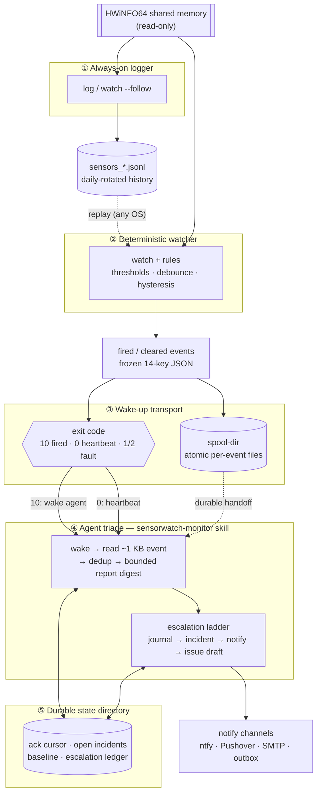

# Agent monitoring: architecture and event contract

How sensorwatch lets an AI agent *monitor* hardware over days and weeks without
burning context — and why the design generalizes to any "agent that keeps an
eye on something." This document lands with the `watch` subcommand (LEO-336);
it is the reference for the event contract that `watch` emits and the
[`sensorwatch-monitor` skill](../skills/sensorwatch-monitor/SKILL.md) consumes.

## Overview

The organizing principle is **deterministic before agentic**: anything that can
be a rule *is* a rule. The watcher *notices* — thresholds, hysteresis,
debounce, staleness, source loss all live in config-driven, sample-count-based
native code that produces bit-identical results under replay. The agent
*interprets* — it is woken only when a rule has already fired, reads a small
structured event, and decides what it means and what to do.

That split is what keeps an always-on monitor affordable. An LLM is never in
the loop for *detecting* a condition (that would be slow, non-deterministic,
and expensive); it is in the loop only for judgment, on a bounded input, when
something has provably happened. The process exiting *is* the wake-up.

## The five layers



| Layer | What it is | Where it lives |
|-------|------------|----------------|
| 1. Always-on logger | Byte-stable JSONL capture of every sample | `log`, or `watch --follow` |
| 2. Deterministic watcher | Rules over samples → fired/cleared events | `watch` + `[[rules]]` |
| 3. Wake-up transport | The process exit *is* the signal; spool is durable handoff | `watch` exit codes + `--spool-dir` |
| 4. Agent triage protocol | Wake → read event → bounded digest → act | [`sensorwatch-monitor` skill](../skills/sensorwatch-monitor/SKILL.md) |
| 5. Durable state directory | Ack cursor, open incidents, baseline, escalation ledger | [`sensorwatch-monitor` state dir](../skills/sensorwatch-monitor/SKILL.md#state-directory) |

**1. Always-on logger.** `log` (and `watch --follow`) append one JSON record
per sample to `sensors_YYYY-MM-DD.jsonl`, with daily rotation and retention.
This is the raw history — humans and offline analysis read it; the agent does
not.

**2. Deterministic watcher.** `watch` evaluates the config's `[[rules]]`
against each sample. Evaluation is **sample-count based** and consumes
timestamps from the data stream, never the wall clock, so the same input always
produces the same fired/cleared transitions — which is what makes rules
testable by **replaying** recorded logs (`--replay`) on any platform, before
any live wiring exists. Rules always evaluate the **full, unfiltered** sample
stream — the `[sensors]` include/exclude filter scopes only what `watch --follow`
writes to `sensors_*.jsonl`, never rule evaluation. A rule can therefore fire on
a reading its neighbouring sensor log omits; give each rule its own
`sensor`/`reading`/`type` matchers to scope what it watches.

**3. Wake-up transport.** The blocking one-shot `watch` exits `10` the instant a
rule fires and `0` on a timeout — *the exit code is the message*. A supervisor
re-runs `watch` and dispatches each exit to a fresh agent invocation, so
context never grows across wake-ups. When `--spool-dir` is set, each event is
also written as its own atomic file (temp name, then rename), giving an
at-least-once durable handoff that survives an agent that was not listening.

**4. Agent triage protocol.** On a fired event the agent's loop is: wake → read
the ~1 KB event → pull one size-capped `sensorwatch report` digest → act. It
never reads raw logs — `report` (shipped in `rust/sensorwatch-cli`) is the
sanctioned bounded window over history. A timeout wake means "heartbeat — verify
all quiet, re-arm." The full protocol — dedup-first, bounded triage capped at two
reports, recording-before-acknowledgment — is the
[`sensorwatch-monitor`](../skills/sensorwatch-monitor/SKILL.md) skill.

**5. Durable state directory.** The agent's memory is a few kilobytes on disk,
not in the context window: an acknowledgment cursor keyed to event **sequence
numbers** (at-least-once, crash-safe), open-incident files with snooze
semantics, a curated baseline of "normal," and an escalation ledger with
cooldowns. Any fresh session reconstructs the monitor from that summary — the
skill's [`state_summary`](../skills/sensorwatch-monitor/SKILL.md#state-directory)
read, hard-capped at ~4 KB. This layer is agent-owned and separate from `watch`'s
own `watch.seq` state (ROADMAP Phase 2).

## The event contract

`watch` emits one JSON object per fired (and, in follow mode, cleared) rule
transition. It is serialized compactly (no byte-compat constraint with the
Python logger — events have no Python counterpart), with keys in exactly this
order:

| # | Key | Type | Presence | Value |
|---|-----|------|----------|-------|
| 1 | `schema_version` | int | always | `1` |
| 2 | `seq` | int | always | persisted monotonic sequence |
| 3 | `id` | string | always | `"{rule}-{seq}"`, e.g. `"psu-12v-sag-42"` |
| 4 | `rule` | string | always | rule name verbatim |
| 5 | `type` | string | always | rule kind, kebab-case |
| 6 | `severity` | string | always | `info` \| `warning` \| `critical` |
| 7 | `state` | string | always | `fired` \| `cleared` |
| 8 | `timestamp` | ISO-8601 string | always | triggering sample's timestamp, verbatim (replay-stable) |
| 9 | `sensor` | string\|null | null for source-unavailable | triggering series sensor |
| 10 | `reading` | string\|null | null for source-unavailable | triggering series reading |
| 11 | `value` | number\|null | null for missing/source-unavailable or NaN | compared value at the edge |
| 12 | `unit` | string\|null | null for source-unavailable | series' last-seen unit |
| 13 | `threshold` | number\|null | null for non-value kinds | configured threshold |
| 14 | `samples_in_violation` | int | always | debounce count (fired) / episode total (cleared) |

Example (~250 bytes; a representative event is unit-tested at under 1 KB):

```json
{"schema_version":1,"seq":42,"id":"psu-12v-sag-42","rule":"psu-12v-sag","type":"threshold","severity":"critical","state":"fired","timestamp":"2026-02-18T08:00:20.000000-05:00","sensor":"MEG Ai1600T","reading":"+12V","value":11.4,"unit":"V","threshold":11.6,"samples_in_violation":2}
```

**Schema version policy.** Additive changes (new optional keys) keep
`schema_version` at `1`; renaming or removing an existing key bumps it. A
consumer that pins on `1` can safely ignore unknown keys.

**Sequence semantics.** `seq` is monotonic, **not dense**: it is persisted to
`<log_dir>/watch.seq` (ASCII decimal of the last-used value) *before* the event
is emitted anywhere, so a crash between persisting and emitting only ever
*skips* a number — never reuses one. Ack cursors therefore key off `seq`, never
wall clock. Cleared events consume sequence numbers too (one uniform cursor).
The design assumes a **single watcher per state directory**; concurrent
watchers on one directory are out of scope.

**Id derivation.** `id` is `"{rule}-{seq}"` — stable, unique, and human-legible
in a spool listing.

**Spooling.** With `--spool-dir`, each event is written as
`{seq:010}-{slug}.json` (zero-padded so lexicographic order equals numeric
order; `slug` is the rule name lowercased with unsafe characters folded to
`-`). Writes are atomic: a `.tmp` file is written and then renamed, and agents
glob `*.json`, so a partially written file is never observed. `watch` never
deletes spool files — cleanup is the agent's ack protocol (Phase 2).

**Exit codes** (the whole CLI, fixed here):

| Code | Meaning |
|------|---------|
| 0 | Clean: snapshot printed; `log` clean shutdown; `watch` one-shot timeout with no event (heartbeat); `watch` replay exhausted |
| 1 | Fatal: platform/source startup failure; signal-handler install failure; an existing config that cannot be read; state/log/spool directory or seq-store *preparation* failure; `watch.seq` persistence failure |
| 2 | Usage: clap errors; invalid `[[rules]]`; zero rules configured; zero rules after filters; unknown `--rule` name |
| 10 | `watch` one-shot: a rule fired (the JSON event is on stdout) |
| 130 | Interrupted by a signal — `watch` only, both modes, including Windows Ctrl-C (`log` keeps its documented Ctrl-C = 0) |

Exit `1` covers *preparation* and the `watch.seq` integrity anchor only. A
failed per-record `events_`/spool **write** is deliberately **not** fatal: it is
warned on stderr and swallowed so a follow watcher survives disk pressure. The
seq is already persisted before any sink is touched, so a lost write leaves a
visible gap in an otherwise monotonic sequence — which ack cursors reconcile
against — rather than reusing a number or crashing the monitor. `watch.seq`
itself is the one durability guarantee; its persistence failure *is* fatal.

Source loss is deliberately **not** an exit code: it surfaces as the
`source-unavailable` rule *kind* in an event, so agents dispatch on event
content, not on a process code.

**One-shot re-arm semantics.** Engine state is per-process. Each time a
supervisor re-runs a blocking `watch`, the debounce counter starts fresh, so a
condition that is still present re-fires within `for_samples` samples. A
persisting problem thus keeps producing events (throttled by the agent's
open-incident/snooze state in layer 5), rather than firing once and going
silent.

## Context-budget principles

The agent layer keeps hard size bounds *by design*, not by convention:

- Events are fixed-shape (14 keys) and typically ~250 bytes; a representative
  event is unit-tested under 1 KB. The only variable-length inputs are the rule
  name and the sensor/reading/unit strings, so short rule names keep events
  comfortably inside a kilobyte (there is no length cap on the strings
  themselves — a pathologically long configured name would exceed it).
- The `report` digest is hard-capped by `--max-bytes` (default ~8 KB): detail
  is dropped worst-first (reading rows, then gaps, then the oldest violations)
  while the meta block always survives.
- Durable state is kilobyte-scale summaries.
- The protocol forbids reading raw history — an agent never loads a day of
  logs into its context.

Together these mean a monitoring session's context does not grow with the
monitored history: a week-long watch costs the same per wake-up as the first
one.

## Generalization: autonomous PR review

The architecture — *deterministic watcher → classified event → durable spool →
ack cursor → bounded digest → agent wake* — is not specific to hardware. It is
the shape of **any** agent that keeps an eye on a stream of events, and it maps
cleanly onto autonomous PR review (LEO-257):

- The **watcher** is a CI/webhook poller instead of a sensor sampler: a
  deterministic rule ("a PR is open, mergeable, and CI is green") replaces a
  threshold rule.
- The **classified event** is a "review-ready PR" record carrying a monotonic
  `seq`, the PR number, head SHA, and author — structurally identical to a
  sensor event, and just as bounded.
- The **spool** is a review queue; the **ack cursor** is the last-reviewed
  `seq`, giving crash-safe at-least-once review with no double-reviews.
- **Triage** consumes a bounded diff digest (the PR analog of `report`), never
  the entire diff, keeping each review's context flat regardless of PR size.

The watcher notices; the agent reviews. Same five layers, same context
guarantees — the only things that change are the source adapter and the rule
vocabulary.
